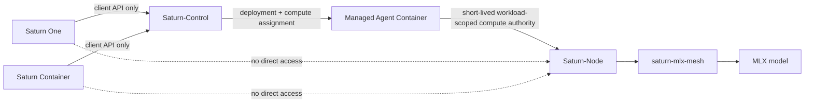
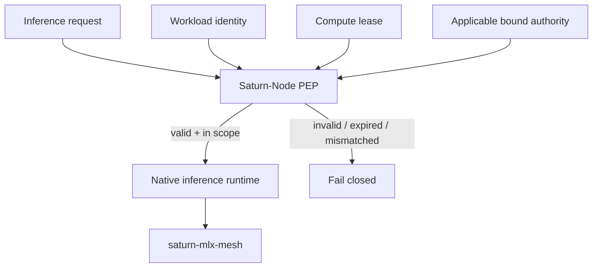
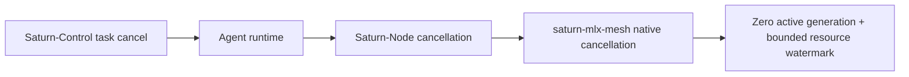

# Saturn-Node

**Status:** In development - service boundary and proposed v1 contract only  
**Visibility:** Private  
**Operational service:** Not implemented

Saturn-Node is the private, workload-authenticated MLX inference service in the Saturn execution plane.

## Canonical runtime path



Frontends never call Saturn-Node directly. Saturn-Control assigns compute and issues short-lived, deployment-scoped authority to an authorized agent workload.

## Enforcement boundary



Saturn-Node verifies the exact workload, node, model, limits, budget, expiry/revocation, and applicable bound authority before MLX execution. It does not trust frontend approval state or agent self-assertions.

## Ownership

Saturn-Node owns private workload-authenticated inference transport, credential verification and revocation state, model allowlisting, pinned manifests, streamed inference, cancellation, bounded resource limits, metadata-only usage evidence, and service recovery.

It does not own Apple Container lifecycle, Saturn-Control orchestration, agent tools, frontend APIs, public exposure, ACP parsing, distributed-mesh research, or canonical ethical principles.

## Cancellation boundary



A client-visible `cancelled` state is insufficient. The service must eventually prove native termination, removal from active execution, request-owned resource reclamation, and successful subsequent inference on real Apple hardware.

## Current repository state

The repository contains:

- a Swift 6 package and fail-closed executable boundary;
- typed model-manifest, workload-claim, authorization, request, event, and runtime seams;
- deterministic bootstrap tests;
- a proposed workload compute contract under `docs/contracts/v1/`;
- strict JSON fixtures and a fragmented-SSE fixture;
- a standard-library validator executed by CI;
- narrow simulation-backed `MeshInferenceRuntimeAdapter` (not selected by default composition);
- non-secret example configuration and operations guidance.

It does not provide a production listener, production cryptographic verifier, production runtime adapter selection, model installation, launchd service, firewall rule, or deployed SN01 service.

## KF / mesh#1 model pin

Primary allowlist candidate aligned with mesh `AcceptanceModelPin`:

| Field | Value |
|-------|--------|
| Model ID | `mlx-community/Qwen3-8B-4bit` |
| Example manifest | `config/model-manifest.example.json` |
| Mesh procedure | `saturn-mlx-mesh` → `Docs/ACCEPTANCE-MODEL.md` |

**32B is not the primary KF path.** Default composition remains `UnavailableInferenceRuntime`. Real runtime opt-in is Founder-gated after mesh#1 evidence is recorded.

## Contract review

The proposed private compute contract is:

- `docs/COMPUTE-CONTRACT.md`;
- `docs/WORKLOAD-IDENTITY.md`;
- `docs/contracts/v1/schema.json`;
- `docs/contracts/v1/fixtures.json`;
- `docs/contracts/v1/stream.sse`.

The semantic claims are independent of their cryptographic envelope. The canonical Saturn authority/receipt contract must remain separately versioned and shared by its issuer/verifiers rather than reimplemented as Node-local lookalike structs.

## Verification

```sh
swift package dump-package
python3 scripts/validate_saturn_node_contract.py
swift test
swift run saturn-node
```

The executable intentionally reports that no production listener or inference runtime is configured.

## Next gates

1. Freeze the canonical workload/compute contract and compatible authority binding.
2. Update Swift types and tests to consume frozen fixtures.
3. Add production credential/authority verification after security review.
4. Keep deterministic fake-runtime streaming and cancellation tests green.
5. Record mesh#1 hardware evidence for `Qwen3-8B-4bit` (load, stream, cancel, restart).
6. Opt-in real `MLXInferenceRuntime` composition only after Founder approval.
7. Add private transport and health/recovery behavior.
8. Request explicit approval before launchd, firewall, credentials, model installation, or SN01 deployment.

## License

This is private EvoCortexAI source. No public license or rights grant is implied by repository access.
