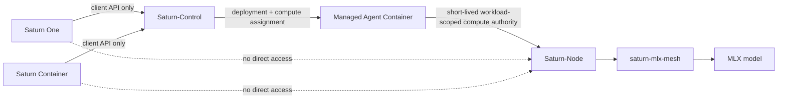
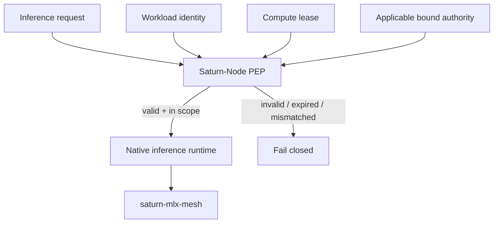
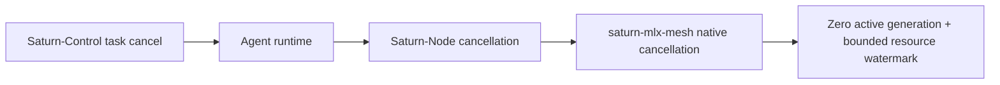

# Saturn-Node

**Status:** In development - service boundary and proposed v1 contract only  
**Visibility:** Private  
**Operational service:** Not implemented  
**Current development license:** Apache License 2.0. See [`LICENSE`](LICENSE) and [`NOTICE`](NOTICE).

Saturn-Node is the private, workload-authenticated MLX inference service in the Saturn execution plane.

Architecture flowcharts: [`docs/ARCHITECTURE.md`](docs/ARCHITECTURE.md). Versioning: [`docs/VERSIONING.md`](docs/VERSIONING.md).

## Canonical runtime path



Frontends never call Saturn-Node directly. Saturn-Control assigns compute and issues short-lived, deployment-scoped authority to an authorized agent workload.

## Enforcement boundary



Saturn-Node verifies the exact workload, node, model, limits, budget, expiry/revocation, and applicable bound authority before MLX execution. It does not trust frontend approval state or agent self-assertions.

## Ownership

Saturn-Node owns private workload-authenticated inference transport, credential verification and revocation state, model allowlisting, pinned manifests, streamed inference, cancellation, bounded resource limits, metadata-only usage evidence, and service recovery.

It does not own Apple Container lifecycle, Saturn-Control orchestration, agent tools, frontend APIs, public exposure, ACP parsing, distributed-mesh research, or canonical ethical principles.

## Cancellation boundary



A client-visible `cancelled` state is insufficient. The service must eventually prove native termination, removal from active execution, request-owned resource reclamation, and successful subsequent inference on real Apple hardware.

## Current repository state

The repository contains:

- a Swift 6.3 / macOS 26 package and fail-closed executable boundary;
- typed model-manifest, workload-claim, authorization, request, event, and runtime seams;
- deterministic bootstrap tests;
- a proposed workload compute contract under `docs/contracts/v1/`;
- strict JSON fixtures and a fragmented-SSE fixture;
- a standard-library validator executed by CI;
- a runtime-agnostic `MeshInferenceRuntimeAdapter` that supports deterministic simulation and explicit real MLX hardware smoke;
- a real-hardware `--real-smoke` path that remains opt-in and does not open a listener;
- a deterministic sustained-acceptance runner that reuses one loaded runtime for repeated completion and cancellation/recovery cycles;
- non-secret example configuration and operations guidance.

It does not provide a production listener, production cryptographic verifier, production runtime adapter selection, model installation, launchd service, firewall rule, or deployed SN01 service.

## KF / mesh#1 model pin

Primary allowlist candidate aligned with mesh `AcceptanceModelPin`:

| Field | Value |
|-------|--------|
| Model ID | `mlx-community/Qwen3-8B-4bit` |
| Example manifest | `config/model-manifest.example.json` |
| Mesh revision | `8ce1d6f6d6f5304f526019a5b5bcbf3f2b2f783e` |
| Mesh 0.2.0 candidate | `9aab96a2e24817fbb1898f8c133ad44469986805` (docs merge; not a tag) |
| Mesh procedure | `saturn-mlx-mesh` → `Docs/ACCEPTANCE-MODEL.md` |

**32B is not the primary KF path.** Default composition remains `UnavailableInferenceRuntime`. The real runtime is selected only by explicit hardware-smoke invocation and does not make Saturn-Node operational.

## Real-hardware smoke

On the selected Apple Silicon acceptance host:

```sh
swift run saturn-node --real-smoke
swift run saturn-node --real-smoke --cancel-recovery
swift run saturn-node --real-smoke --requests 20 --cancellations 5
```

The baseline command loads the pinned real mesh runtime, sends one request through `MeshInferenceRuntimeAdapter`, validates contiguous Saturn event sequencing, and reports metadata-only load / first-delta / generation timing. Generated content is suppressed by default.

The legacy cancellation command additionally cancels an active real request, requires a contiguous cancelled terminal, verifies no active mesh request remains, and requires a subsequent request to complete successfully. `--show-content` is local-debug only and must not be used for standard acceptance evidence.

The sustained command loads the model once in one process, runs 20 ordinary completion requests, then performs 5 independent cancellation → quiescence → recovery cycles. Each recovery request is additive to the 20 ordinary requests. It reports per-request timing plus internal min/median/p95 summaries and fails closed on request, cancellation, recovery, sequencing, or quiescence failure.

A failed real smoke exits non-zero. Passing the one-shot commands is necessary basic hardware evidence, not sustained or production-service acceptance. The sustained hardware gate also requires the configured counts plus a successful fresh-process restart; see `docs/ACCEPTANCE-TEST.md`.

## Deadline status

The adapter rejects requests that are already expired, maps runtime timeout failures to `requestTimedOut`, and enforces a hard wall-clock `deadlineAt` that expires *during* active generation: mesh cancel, stream finishes with `requestTimedOut`, sequence cleared, subsequent request allowed. Explicit cancel before the deadline still yields a contiguous `.cancelled` terminal. Closing this runtime-contract gate does not authorize transport, credentials, or deployment.

## Contract review

The proposed private compute contract is:

- `docs/COMPUTE-CONTRACT.md`;
- `docs/WORKLOAD-IDENTITY.md`;
- `docs/contracts/v1/schema.json`;
- `docs/contracts/v1/fixtures.json`;
- `docs/contracts/v1/stream.sse`.

The semantic claims are independent of their cryptographic envelope. The canonical Saturn authority/receipt contract must remain separately versioned and shared by its issuer/verifiers rather than reimplemented as Node-local lookalike structs.

## Verification

```sh
swift package dump-package
python3 scripts/validate_saturn_node_contract.py
swift test
swift run saturn-node
```

The default executable intentionally reports that no production listener or inference runtime is configured.

## Next gates

1. Record the basic real M4 Pro hardware evidence for the pinned `Qwen3-8B-4bit` path through both mesh and Node in the controlling trackers.
2. Pass the sustained 20/20 ordinary + 5/5 cancellation/recovery acceptance and a fresh-process restart on the selected hardware host.
3. In-flight `deadlineAt` runtime-contract gate (deterministic tests required; optional one-shot hardware confirmation).
4. Freeze the canonical workload/compute contract and compatible authority binding.
5. Add production credential/authority verification after security review.
6. Add private transport, disconnect propagation, health/recovery behavior, and managed restart acceptance.
7. Request explicit approval before launchd, firewall, credentials, model installation, or SN01 deployment.

## License

Current `main` first-party materials are offered under the Apache License, Version 2.0. See `LICENSE` and `NOTICE`.

This repository has no published semantic release tag. The next published semantic release is the first Apache-2.0 release. Do not treat prior private snapshots as Apache-2.0 publication.

Third-party software remains under its own terms. This license does not grant trademark rights in Saturn, Saturn-Node, or EvoCortexAI except as required for reasonable attribution.

This change licenses current development source; it does not by itself make the GitHub repository public.
