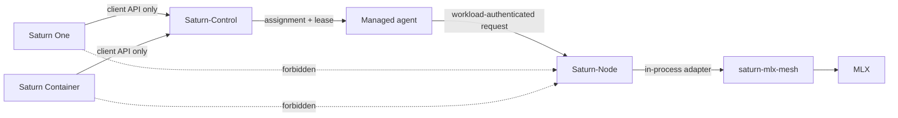
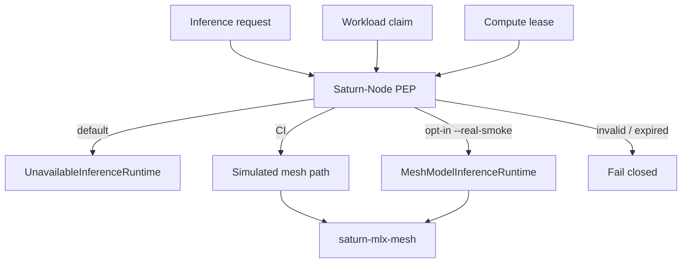
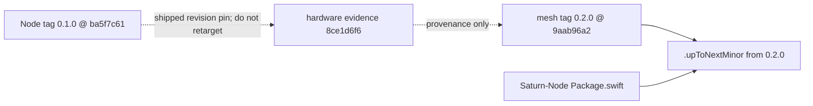
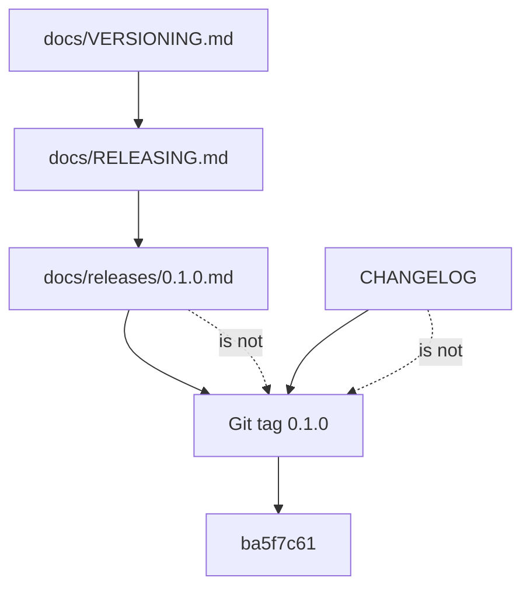
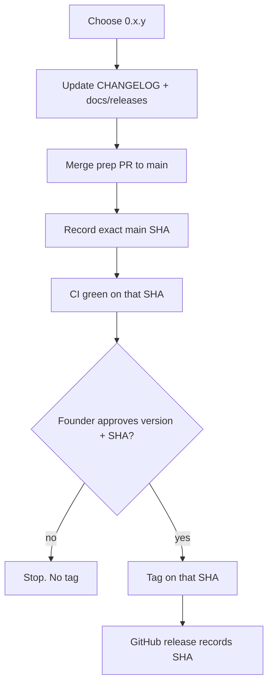
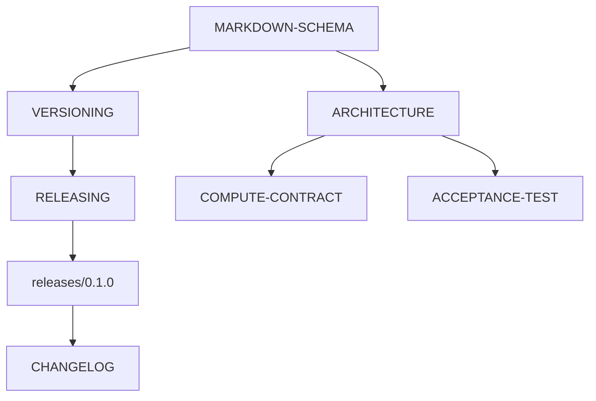

# Architecture

**Type:** architecture
**Status:** binding-after-merge for the `0.1.x` contract diagrams
**Authority:** diagrams describe the fail-closed boundary; they do not authorize SN01
**Schema:** docs/MARKDOWN-SCHEMA.md

Saturn-Node `0.1.x` views. Issue #4 remains open.

## Saturn execution plane

## Enforcement boundary

Default composition is fail-closed. The ordinary executable does not construct real MLX.

## Mesh dependency

Published mesh tag `0.2.0` is `9aab96a2e24817fbb1898f8c133ad44469986805`. Current Node `main` consumes `.upToNextMinor(from: "0.2.0")`. Node `0.1.0` keeps the revision pin it shipped; do not retarget that tag.

## Version identity

## Release procedure

No tag authorizes a listener or SN01.

## Doc architecture

