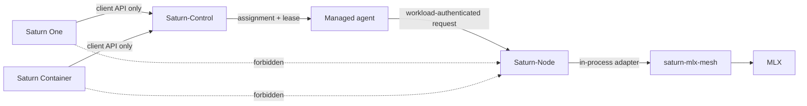
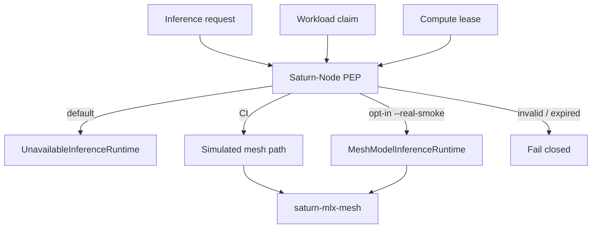
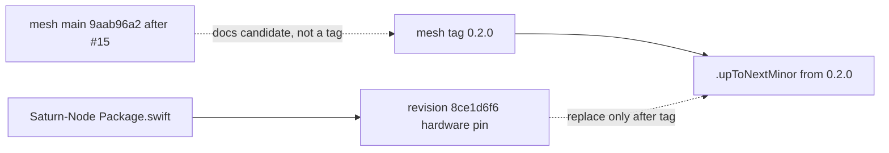
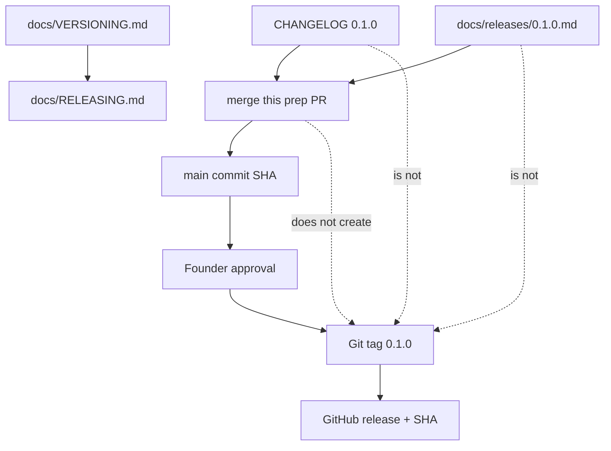
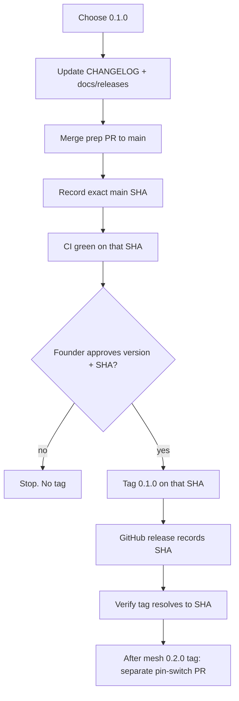
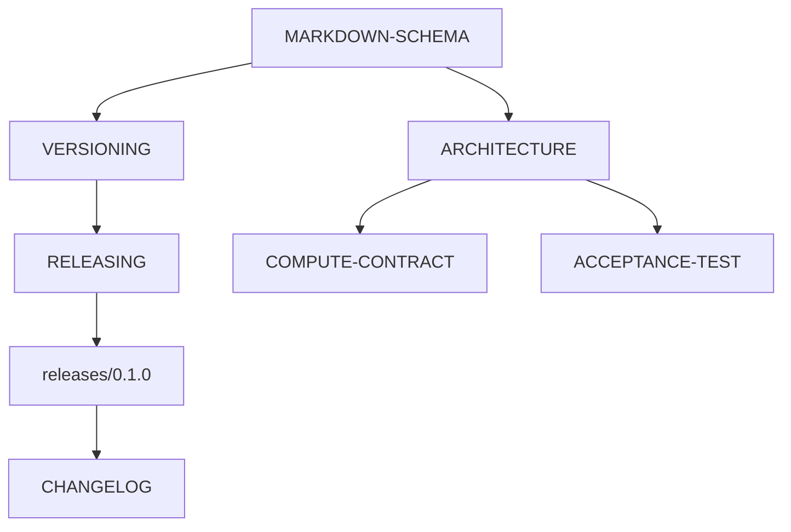

# Architecture

**Type:** architecture
**Status:** binding-after-merge for the `0.1.x` contract diagrams
**Authority:** diagrams describe the fail-closed boundary; they do not publish a tag or authorize SN01
**Schema:** docs/MARKDOWN-SCHEMA.md

These flowcharts are the architecture views for Saturn-Node `0.1.x`. Issue #4 remains open.

## Saturn execution plane

## Enforcement boundary

Default composition is fail-closed. Real MLX is not constructed by the ordinary executable.

## Mesh dependency

`saturn-mlx-mesh` PR #15 merged to `main` at `9aab96a2e24817fbb1898f8c133ad44469986805`. That SHA is the mesh `0.2.0` *candidate*. It is not the tag. Node keeps revision `8ce1d6f6d6f5304f526019a5b5bcbf3f2b2f783e` until the tag exists.

## Version identity

## Release procedure

## Doc architecture

