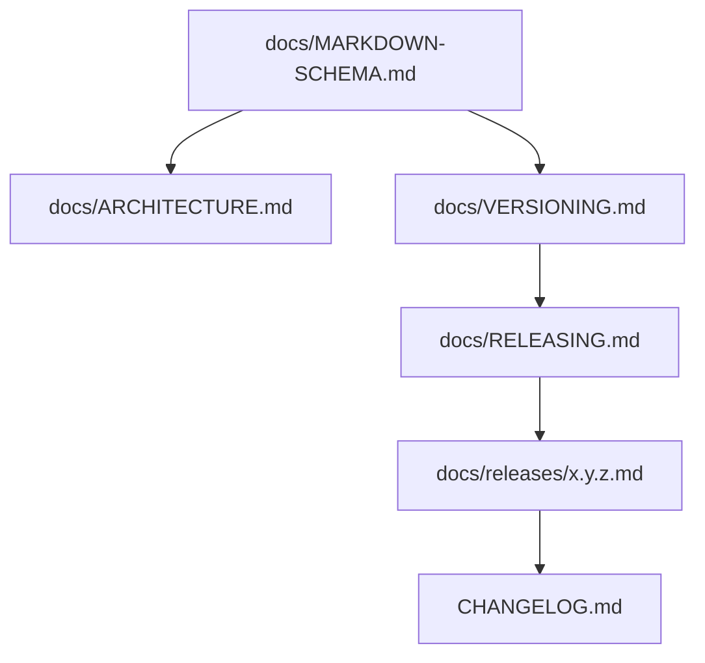

# Markdown schema (version and release docs)

**Type:** schema
**Status:** binding for files that declare a version or release
**Authority:** does not publish a tag; does not close issue #4; does not authorize a listener

This file is the schema for Saturn-Node markdown that talks about versions. If a file disagrees with this schema, the file is wrong.

Package docs live under lowercase `docs/`.

## File map

| Path | Type | Role |
|------|------|------|
| `README.md` | overview | Product boundary. Not a release. |
| `CHANGELOG.md` | changelog | Dated sections are history, not tags. |
| `docs/ARCHITECTURE.md` | architecture | Mermaid flowcharts for plane, PEP, mesh pin, release. |
| `docs/VERSIONING.md` | versioning-policy | Compatibility contract. |
| `docs/RELEASING.md` | release-procedure | How a tag is created. Merge does not tag. |
| `docs/releases/<x.y.z>.md` | release-record | Prep notes for one intended version. |
| `docs/MARKDOWN-SCHEMA.md` | schema | This file. |
| `docs/COMPUTE-CONTRACT.md` | contract | Proposed v1 compute contract. |
| `docs/ACCEPTANCE-TEST.md` | acceptance | Hardware / sequence evidence rules. |



## Required header

```text
# <Title>

**Type:** <one type from the file map>
**Status:** <draft | binding-after-merge | published-tag-pending | published>
**Authority:** <what this file must not be mistaken for>
**Schema:** docs/MARKDOWN-SCHEMA.md
```

`CHANGELOG.md` is header-exempt. An optional pointer to `ARCHITECTURE.md` may sit after the header.

## Type schemas

### `architecture`

Required sections: Saturn execution plane; Enforcement boundary; Mesh dependency; Version identity; Release procedure; Doc architecture. Each section one `flowchart`.

### `versioning-policy`

Required sections: Principle; Current release line; Mesh dependency; Before the first stable release; After `1.0.0`; Release provenance.

Must state first published tag is `0.1.0`; Node stays on mesh revision pin until mesh `0.2.0` is a published tag.

### `release-procedure`

Required sections: Release authority; License and publication; Preconditions; Release procedure; Consumer contract; Rollback.

Must state: no `v` prefix; never retarget; founder approval of version + SHA; no tag authorizes listener / SN01.

### `release-record`

Required sections: Intent; What the version includes; What the version is not; Toolchain; License; Mesh follow-up.

### `changelog`

Keep a Changelog. Newest dated section under `Unreleased`. A dated section is not a tag.

## Identity mapping

```text
changelog section  != Git tag
docs/releases/*.md != GitHub release
Git tag            == immutable release identity
commit SHA         == provenance
Package.resolved   == what a consumer builds
```

## Forbidden claims

- Saturn-Node is operational
- this version opens a listener or installs production credentials
- mesh #15 merge is the mesh `0.2.0` tag
- 32B is the primary pin
- current `main` may be tagged as anything other than the approved version after founder SHA approval
