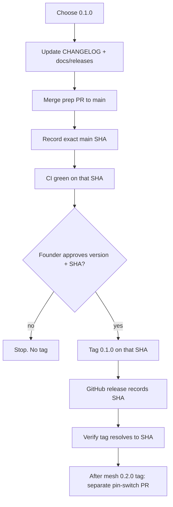

# Releasing Saturn-Node

**Type:** release-procedure
**Status:** binding-after-merge; published-tag-pending for `0.1.0`
**Authority:** procedure only; merge of this file does not create a tag or authorize SN01
**Schema:** docs/MARKDOWN-SCHEMA.md

Architecture views: [`ARCHITECTURE.md`](ARCHITECTURE.md).

Saturn-Node is released as a versioned Swift package. A release is a compatibility and provenance boundary, not an operational deploy.

Merging documentation or feature work does not itself authorize or create a release. No release tag authorizes a listener, production credentials, launchd, or SN01 install.



## Release authority

Every release requires explicit approval of the intended version and release commit. Tags are immutable after publication and must never be retargeted.

Version semantics are defined in `VERSIONING.md`.

## License and publication

- `LICENSE` must contain the unmodified official Apache License 2.0 text.
- `NOTICE` records first-party copyright and trademark carve-outs.
- The first published semantic release is `0.1.0` and is the first Apache-2.0 release.
- GitHub repository visibility remains a separate publication decision.

## Preconditions

Before publishing any `0.x.y` release:

- `main` is the intended source and package CI is green on the exact release commit;
- `swift package dump-package` succeeds;
- contract validator and `swift test --parallel` succeed;
- fail-closed executable smoke succeeds (`swift run saturn-node`);
- `CHANGELOG.md` contains a dated section for the intended version;
- `docs/releases/<version>.md` records what the version is and is not;
- mesh dependency is either the approved revision pin or the published `0.2.x` line;
- no known release-blocking correctness or security defect remains open;
- the release version and exact release commit have explicit founder approval.

## Release procedure

1. Choose the version according to `VERSIONING.md`.
2. Update `CHANGELOG.md` and `docs/releases/<version>.md`.
3. Merge the release-preparation PR to `main` without creating a tag as a side effect.
4. Record the resulting exact `main` commit SHA as the release candidate.
5. Verify CI on that exact commit.
6. Obtain explicit approval for the version and exact candidate SHA.
7. Create an immutable Git tag matching the semantic version, for example `0.1.0`. Do not prefix with `v`.
8. Create the GitHub release. Notes must record the exact commit SHA.
9. Verify the published tag resolves to that SHA.
10. After `saturn-mlx-mesh` `0.2.0` exists, land a separate Node PR switching the mesh pin to `.upToNextMinor(from: "0.2.0")` with `Package.resolved`.

## Consumer contract

```swift
.package(
    url: "https://github.com/EvoCortexAI/saturn-node.git",
    .upToNextMinor(from: "0.1.0")
)
```

A floating `branch: "main"` is never an approved dependency.

## Rollback

Never retarget a published tag. Publish a new patch or minor version instead.
