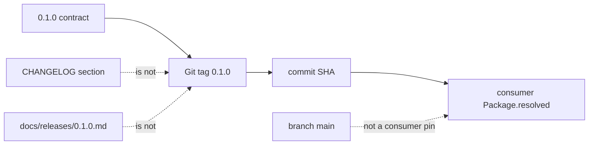

# Versioning

**Type:** versioning-policy
**Status:** binding-after-merge; published-tag-pending for `0.1.0`
**Authority:** compatibility contract only; this file is not a Git tag
**Schema:** docs/MARKDOWN-SCHEMA.md

Architecture views: [`ARCHITECTURE.md`](ARCHITECTURE.md).

## Principle

Saturn-Node uses semantic versions as the published package and evidence identity.

A released version identifies an immutable Git tag, and that tag resolves to one exact commit SHA. Downstream consumers that treat Node as a Swift package declare a bounded semantic version requirement and commit `Package.resolved`. Raw commit SHAs remain provenance and CI-verification data.

```text
semantic version = compatibility contract
Git tag          = immutable release identity
commit SHA       = source provenance
Package.resolved = exact consumer resolution
```



Do not use a floating branch as a package dependency. Do not retarget a released version tag.

The operational release procedure is defined in `RELEASING.md`.

## Current release line

This repository has no published semantic tag on `main` today. The first published semantic release is `0.1.0`. It is the first Apache-2.0 tagged release. The active pre-1.0 compatibility line after publication is `0.1.x`.

`0.1.0` is a fail-closed service-boundary package with a proposed compute contract, deterministic tests, and an opt-in real-MLX smoke path. It is **not** an operational listener, production verifier, or SN01 deploy.

## Mesh dependency

Saturn-Node consumes `saturn-mlx-mesh`.

- Hardware-accepted revision pin remains `8ce1d6f6d6f5304f526019a5b5bcbf3f2b2f783e`.
- Mesh PR #15 (versioning docs + Apache first-published-line prep) merged to mesh `main` at `9aab96a2e24817fbb1898f8c133ad44469986805`. That SHA is the mesh `0.2.0` candidate. It is **not** the mesh tag.
- Until `saturn-mlx-mesh` `0.2.0` is a published Git tag, Node keeps the revision pin. Do not switch `Package.swift` in this PR.
- After that tag exists, Node must switch in a **separate** PR to:

```swift
.package(
    url: "https://github.com/EvoCortexAI/saturn-mlx-mesh.git",
    .upToNextMinor(from: "0.2.0")
)
```

and commit `Package.resolved`. CI must verify origin, resolved version, and exact resolved SHA.

A floating `branch: "main"` mesh or ethics-framework dependency is not an approved release contract.

## Before the first stable release

Use `0.x.y` while the private service contract is stabilizing.

- `0.x.0` may introduce deliberate contract/API changes.
- `0.x.y` patch releases contain compatible fixes within the current minor line.
- Direct revision dependencies are reserved for approved temporary recovery and must not remain the normal contract.

Each new pre-1.0 tag is created only after release scope is approved and all gates in `RELEASING.md` pass.

## After `1.0.0`

Requires the secure single-node MVP acceptance in issue #4: authenticated private request, pinned model, stream, cancel/complete, metadata evidence, cleanup, subsequent request. A tag does not by itself make Node operational.

## Release provenance

```text
version -> immutable tag -> exact commit SHA
```
