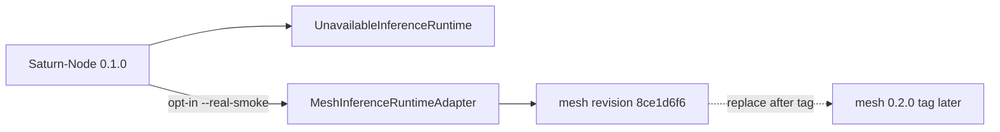

# Saturn-Node 0.1.0

**Type:** release-record
**Status:** published-tag-pending
**Authority:** release-prep notes only; this file is not a Git tag or GitHub release
**Schema:** docs/MARKDOWN-SCHEMA.md

Architecture views: [`../ARCHITECTURE.md`](../ARCHITECTURE.md).

First published semantic release. First Apache-2.0 tagged release.

This file is the release-prep record. The immutable tag-to-SHA mapping is written in the GitHub release after founder approval. Do not treat this document as a published tag.

## Intent

Identify the current fail-closed service-boundary package so KF and consumers can cite a version instead of a raw SHA.

## What 0.1.0 includes

- Swift 6.3 / macOS 26 package and fail-closed executable.
- Proposed workload compute contract v1 fixtures + validator.
- Deterministic tests (claims, fake stream, cancel, unavailable runtime, in-flight `deadlineAt`).
- Opt-in `--real-smoke` / sustained hardware runner. Default composition remains `UnavailableInferenceRuntime`.
- Mesh revision pin `8ce1d6f6d6f5304f526019a5b5bcbf3f2b2f783e` until mesh `0.2.0` is tagged.
- Mesh `0.2.0` candidate recorded: `9aab96a2e24817fbb1898f8c133ad44469986805` (saturn-mlx-mesh#15 merge). Not a tag.

## What 0.1.0 is not

- Not operational.
- No production listener.
- No production credential verifier.
- No launchd / firewall / SN01 production install.
- Not a public API. Not SaaS. Not multi-node.

## Toolchain

- Swift tools 6.3
- macOS 26
- CI Xcode 26.6

## License

Apache License 2.0 for current `main` first-party materials.

## Mesh follow-up

Switch `Package.swift` to `.upToNextMinor(from: "0.2.0")` and commit `Package.resolved` only after the mesh `0.2.0` tag exists. That switch is a separate Node PR. Do not retarget this Node `0.1.0` tag if the mesh pin later changes; publish `0.1.1` if a pin-switch must be versioned after Node `0.1.0` is already tagged.
